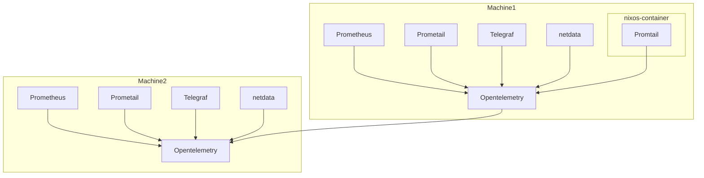

> This repository is under redesign. In a few weeks this all options will be
> rearranged.

Check out [OPTIONS.md](./OPTIONS.md)

A NixOS Flake that provides predefined telemetry configurations for various
observability tools, leveraging
[OpenTelemetry](https://opentelemetry.io/docs/collector/) as the core transport
layer. The aim is to simplify the deployment and configuration of telemetry
solutions like Prometheus, Netdata, and Promtail by shipping all telemetry data
through OpenTelemetry and sending it to analysis tools such as Loki or
Prometheus for further monitoring and visualization.

## labels

Here are labels, which we try to always set.

_instance:_ Either the host name or the container name.

_host_name:_ The host name also for containers.
