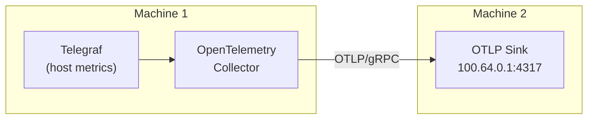
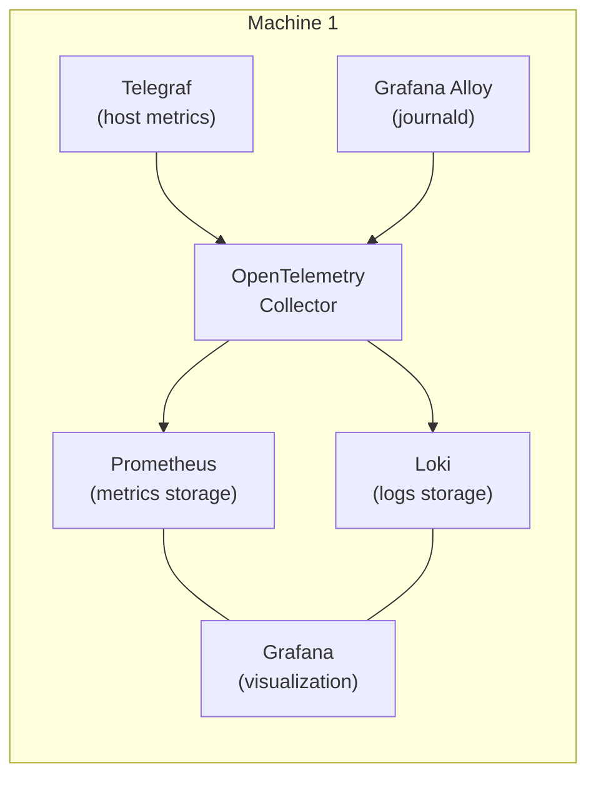
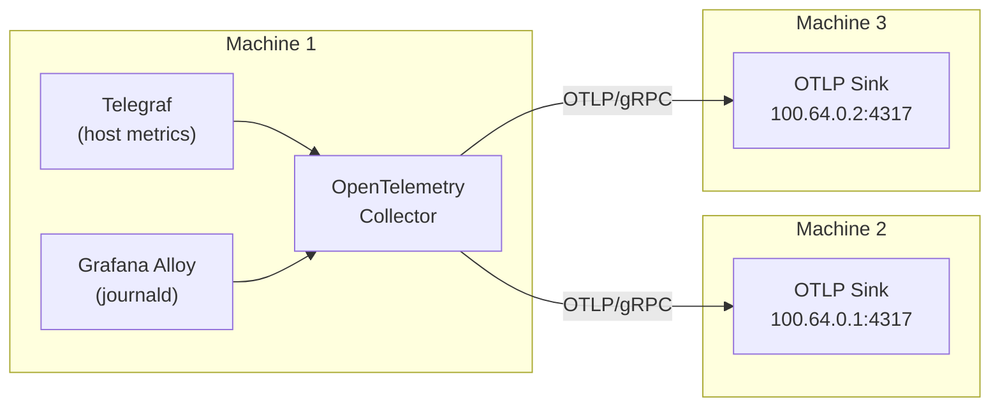

Check out [OPTIONS.md](./OPTIONS.md) for the full option reference.

A NixOS flake that makes it very easy to set up telemetry in your
infrastructure. The OpenTelemetry collector runs at the center of each machine.
Apps that scrape logs or metrics feed data into it when enabled. Apps that store
or visualize telemetry read from it when enabled. You can also forward
everything to another OpenTelemetry collector on a remote machine.

## How it works

Turn on the system with `telemetry.enable = true`. Telemetry services are
auto-wired into the OpenTelemetry collector whenever they are enabled — whether
through the convenience option `telemetry.<app>.enable = true`, or by setting
`services.<app>.enable = true` directly. The collector receives, transforms, and
forwards their data.

The collector starts automatically once a complete pipeline exists. A pipeline
is complete when a source and a sink are both active for the same signal type.
Without a matching pair the collector has nothing to do and will not start.

Each `telemetry.<app>.enable` option enables the underlying NixOS service with
opinionated defaults. If you prefer to manage the service configuration
yourself, just set `services.<app>.enable = true` directly — with
`telemetry.enable = true` set, the OTel wiring kicks in regardless of which
option you used. Without `telemetry.enable`, services are not wired into a
collector.

| Signal    | Receivers (sources)                         | Exporters (sinks)                            |
| --------- | ------------------------------------------- | -------------------------------------------- |
| Metrics   | `telemetry.telegraf`, `telemetry.netdata`   | `telemetry.prometheus`                       |
| Logs      | `telemetry.alloy`                           | `telemetry.loki`                             |
| (Forward) | `telemetry.opentelemetry.receiver.endpoint` | `telemetry.opentelemetry.exporter.endpoints` |

## Example setups

Here are some Examples which can be combined as you like.

### Metrics forwarded to a remote OTLP sink

Collect host metrics with Telegraf and forward them to a remote OpenTelemetry
collector over OTLP/gRPC.


```mermaid
graph LR
    subgraph Machine1["Machine 1"]
        Telegraf["Telegraf<br/>(host metrics)"]
        OTel["OpenTelemetry<br/>Collector"]
    end
    subgraph Machine2["Machine 2"]
        Remote["OTLP Sink<br/>100.64.0.1:4317"]
    end
    Telegraf --> OTel
    OTel -->|OTLP/gRPC| Remote
```

```nix
{
  # machine 1
  telemetry.enable = true;
  telemetry.telegraf.enable = true;
  telemetry.opentelemetry.exporter.endpoints.remote = "100.64.0.1:4317";
}
{
  # machine 2
  telemetry.enable = true;
  telemetry.opentelemetry.receiver.endpoint = "0.0.0.0:4317";
}
```

### Local observability stack with Grafana

Collect host metrics with Telegraf and journald logs with Alloy, store them in
local Prometheus and Loki, and visualize everything with Grafana — all on a
single machine.


```mermaid
graph LR
    subgraph Machine1["Machine 1"]
        Telegraf["Telegraf<br/>(host metrics)"]
        Alloy["Grafana Alloy<br/>(journald)"]
        OTel["OpenTelemetry<br/>Collector"]
        Prometheus["Prometheus<br/>(metrics storage)"]
        Loki["Loki<br/>(logs storage)"]
        Grafana["Grafana<br/>(visualization)"]
    end
    Telegraf --> OTel
    Alloy --> OTel
    OTel --> Prometheus
    OTel --> Loki
    Prometheus --- Grafana 
    Loki --- Grafana
```

```nix
{
  telemetry.enable = true;
  telemetry.telegraf.enable = true;
  telemetry.alloy.enable = true;
  telemetry.prometheus.enable = true;
  telemetry.loki.enable = true;
  telemetry.grafana.enable = true;
}
```

### Metrics and logs fan-out to two remote sinks

Collect host metrics with Telegraf and journald logs with Alloy, then fan both
signals out to two remote OpenTelemetry collectors simultaneously.


```mermaid
graph LR
    subgraph Machine1["Machine 1"]
        Telegraf["Telegraf<br/>(host metrics)"]
        Alloy["Grafana Alloy<br/>(journald)"]
        OTel["OpenTelemetry<br/>Collector"]
    end
    subgraph Machine2["Machine 2"]
        Primary["OTLP Sink<br/>100.64.0.1:4317"]
    end
    subgraph Machine3["Machine 3"]
        Secondary["OTLP Sink<br/>100.64.0.2:4317"]
    end
    Telegraf --> OTel
    Alloy --> OTel
    OTel -->|OTLP/gRPC| Primary
    OTel -->|OTLP/gRPC| Secondary
```

```nix
{
  # machine 1
  telemetry.enable = true;
  telemetry.telegraf.enable = true;
  telemetry.alloy.enable = true;
  telemetry.opentelemetry.exporter.endpoints.primary = "100.64.0.1:4317";
  telemetry.opentelemetry.exporter.endpoints.secondary = "100.64.0.2:4317";
}
{
  # machine 2
  telemetry.enable = true;
  telemetry.opentelemetry.receiver.endpoint = "0.0.0.0:4317";
}
{
  # machine 3
  telemetry.enable = true;
  telemetry.opentelemetry.receiver.endpoint = "0.0.0.0:4317";
}
```

## Usage

### Default import

Add this flake as an input to your own NixOS flake, then import the default
module into the NixOS configuration where you want telemetry:

```nix
{
  inputs = {
    nixpkgs.url = "github:NixOS/nixpkgs/nixos-unstable";
    nixos-telemetry.url = "github:mrVanDalo/nixos-telemetry";
  };

  outputs =
    { self, nixpkgs, nixos-telemetry, ... }:
    {
      nixosConfigurations.myhost = nixpkgs.lib.nixosSystem {
        system = "x86_64-linux";
        modules = [
          nixos-telemetry.nixosModules.default
          {
            telemetry.enable = true;
            telemetry.telegraf.enable = true;
            telemetry.opentelemetry.exporter.endpoints.remote = "100.64.0.1:4317";
          }
        ];
      };
    };
}
```

`nixos-telemetry.nixosModules.default` is the only module you need to import: it
is the super-module that pulls in every app (`opentelemetry`, `telegraf`,
`alloy`, `loki`, `prometheus`, `netdata`, `grafana`). A `nixosModules.telemetry`
alias points at the same module.

### Low-footprint import

If you don't want to lock this flake's own inputs (flake-parts, devshell,
treefmt-nix) into your `flake.lock`, declare the input as non-flake and import
the modules directory directly — the modules are plain NixOS modules with no
extra tooling dependencies:

```nix
nixos-telemetry = {
  url = "github:mrVanDalo/nixos-telemetry";
  flake = false;
};
```

```nix
...
modules = [
  "${nixos-telemetry}/modules"
  {
    telemetry.enable = true;
    telemetry.telegraf.enable = true;
    telemetry.opentelemetry.exporter.endpoints.remote = "100.64.0.1:4317";
  }
];
...
```

## labels

Here are labels, which we try to always set.

_instance_name:_ Either the host name or the container name. Set on metrics (via
telegraf `global_tags`) and on logs (via alloy journal relabel).

_host_name:_ The host name, also for containers. Set on metrics (via the
OpenTelemetry collector `metricstransform` processor) and on logs (via alloy
journal relabel).
